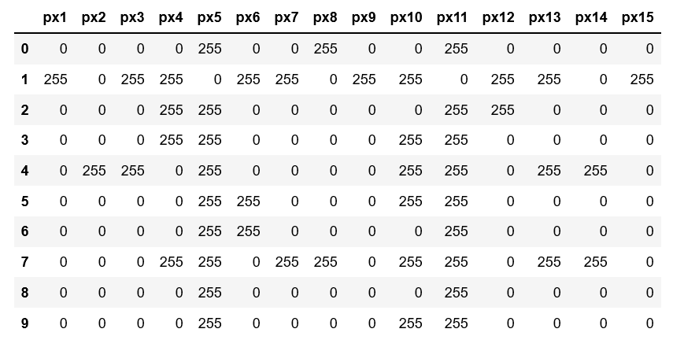
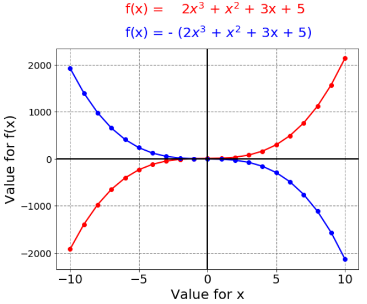

Topics and Documents
=====================

So far, the following topics are included in this repository:

- image processing
- data visualization

|

Image Processing
----------------
The document `picture_format.ipynb <https://github.com/michaelh00/Digital_Scholarship_Tools/blob/master/Image_Processing/picture_format.ipynb>`_ 
illustrates the following procedures:

- how to generate images with numpy arrays
- how to save them in .png format
- how to load and convert them to Python lists
- how to save them in .csv files
- how to read them as pandas dataframes

Here an example of images generated in this document (digits in this case):

Here an example of the data content of these images in table format
(px stands for pixel):

The code documentation in this document is in German.

|

Data Visualization
------------------
The document `basic_data_visualization_math.ipynb <https://github.com/michaelh00/Digital_Scholarship_Tools/blob/master/Data_Visualization/basic_data_visualization_math.ipynb>`_ 
illustrates the following procedures:

- how to generate data using mathematical functions
- how to plot this data using matplotlib
- how to change default plotting options and obtain customized plotting results

Here an example of plotted mathematical functions: 

|

The document `basic_data_visualization_iris.ipynb <https://github.com/michaelh00/Digital_Scholarship_Tools/blob/master/Data_Visualization/basic_data_visualization_iris.ipynb>`_ 
is meant to visualize multidimensional data. Here, the classical Iris data set is used. This document illustrates the following procedures:

- how to generate a pandas dataframe with data downloaded from a repository
- how to generate different types of plots such as scatter plots, histograms, KDE-plots or boxplots
- how to use alternative libraries (e.g. seaborn, numpy or scipy) and alternative methods for data visualization tasks

Here some examples:

Scatterplot
^^^^^^^^^^^^
.. image:: iris_scatterplot.png

|

Boxplot
^^^^^^^^
.. image:: iris_boxplot.png

|

Pairplot
^^^^^^^^^

.. image:: iris_pairplot.png

The code documentation in this document is in English.